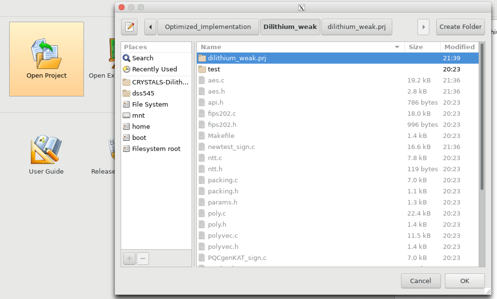

# Hardware Implementation

# Git Instructions
* We are only uploading C files, header files, project settings in Git. git_commands.sh adds only relevent files for this. If you create new project or new solution, this file will take care of uplaoding the necessary files. If you create a new file, you need to write the git add command separately.
* **When you create a new porject in vivado, *ALWAYS END WITH (.prj)* **

# Vivado HLS
# Open Project
* Download the github project in the local repository.
* Open the project. The project name ends with (.prj). One such path for project is: CRYSTALS-Dilithium/Optimized_Implementation/Dilithium_weak/dilithium_weak.prj/
 
* The project has different solutions. Each solution has unique target device, clock period, cosimultation settings, and configuration settings.
 
* For all the solutions, the top module is same. Change or view the top module from, project -> project settings -> synthesis.
 

# C-Simulation 
* The C-simulation is common for all the solution. Run the C-simulation: Project -> Run C Simulation.
 
* We run the C-simulation with debug mode. Simulation does not work on normal mode. Hence, make sure "Launch Debugger" is ticked.
* In the debug mode, run the "Resume(F8)" to start the simulation. If the program works successfully, console shows "Known Answer test PASSED."
 
 

# Synthesis
* Go to: Solution -> Run C Synthesis -> Active Solution. This will start synthesizing function which mentions as Top Module.
 
* Once the syntheis is over, Run "C/RTL Cosimulation": Solution -> Run C/RTL Cosimulation.
 

