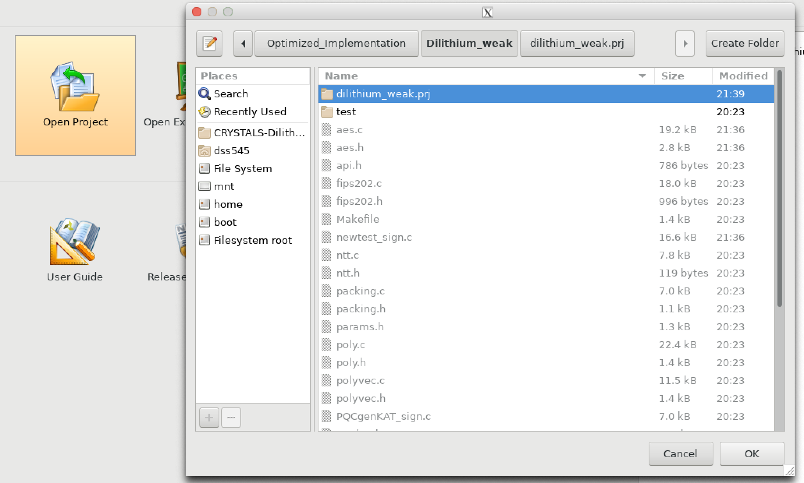

# Hardware Implementation

### Open Project
* Download the github project in the local repository.
* Open the project. The project name ends with (.prj). One such path for project is: CRYSTALS-Dilithium/Optimized_Implementation/Dilithium_weak/dilithium_weak.prj/
 
Format: 
